# Simple Proxy Architecture

A Claude Code proxy that transforms Anthropic API requests to OpenAI-compatible format with extensive customization capabilities and intelligent ExitPlanMode misuse prevention.

## Overview

The Simple Proxy acts as a translation layer between Claude Code (Anthropic API format) and OpenAI-compatible model providers. It provides comprehensive request/response transformation, tool customization, system message overrides, and intelligent model routing with sophisticated workflow-aware tool necessity detection.

## Key Innovation: Dual-Layer ExitPlanMode Protection

The system implements a **dual-layer protection mechanism** to prevent ExitPlanMode misuse at the root cause:

**Layer 1: Tool Necessity Detection** - Prevents inappropriate forced tool usage
**Layer 2: Context-Aware Filtering** - Removes ExitPlanMode when inappropriate

```mermaid
graph TD
    A[User Request] --> B{DetectToolNecessity}
    
    B --> C[Research/Diagnostic]
    B --> D[Clear Implementation]
    
    C --> E[tool_choice=optional]
    D --> F[tool_choice=required]
    
    E --> G[Natural Flow + Context Filtering]
    F --> H[Forced Tools + Available ExitPlanMode]
    
    G --> I[✅ No ExitPlanMode Misuse]
    H --> J[✅ Appropriate Tool Usage]
```



This intelligent system recognizes that commands like "fix bug" or "debug error" require investigation phases before implementation, preventing premature tool forcing that leads to inappropriate ExitPlanMode usage.

## Core Architecture

```
┌─────────────────┐    ┌──────────────────┐    ┌─────────────────┐
│   Claude Code   │───▶│   Simple Proxy   │───▶│  Model Provider │
│ (Anthropic API) │    │  (Translation)   │    │ (OpenAI Format) │
└─────────────────┘    └──────────────────┘    └─────────────────┘
                              │
                              ▼
                    ┌──────────────────┐
                    │  Configuration   │
                    │  & Overrides     │
                    └──────────────────┘
```

## Component Architecture

### 1. Entry Point (`main.go`)

**Responsibilities:**
- HTTP server setup (port 3456 by default)
- Route configuration
- Configuration loading
- Request/response lifecycle management

**Key Routes:**
- `GET /` - Service information
- `GET /health` - Health check  
- `POST /v1/messages` - Main API endpoint (Anthropic-compatible)

### 2. Configuration System (`config/config.go`)

**Multi-Source Configuration with Circuit Breaker:**
```
┌─────────────┐    ┌──────────────────┐    ┌─────────────────┐
│   .env      │───▶│                  │◀───│ tools_override  │
│ (required)  │    │  Configuration   │    │     .yaml       │
└─────────────┘    │     Manager      │    │   (optional)    │
                   │  + Circuit       │◀───┤                 │
┌─────────────┐    │    Breaker       │    │ system_overrides│
│ Environment │───▶│                  │    │     .yaml       │
│ Variables   │    └──────────────────┘    │   (optional)    │
└─────────────┘                            └─────────────────┘
```

**Configuration Features:**
- **Model Mapping**: Claude model names → Provider models
- **Dual Provider Support**: Separate big/small model endpoints
- **Multi-Endpoint Failover**: Comma-separated endpoint lists for correction services
- **Circuit Breaker**: Configurable failure thresholds and backoff timing
- **Tool Filtering**: Skip unwanted tools via `SKIP_TOOLS`
- **Debug Options**: System message printing with `PRINT_SYSTEM_MESSAGE`
- **Security**: API key masking in logs

**Multi-Endpoint Configuration:**
```bash
# Single endpoint (legacy)
TOOL_CORRECTION_ENDPOINT=http://192.168.0.46:11434/v1/chat/completions

# Multiple endpoints with failover (new)
TOOL_CORRECTION_ENDPOINT=http://192.168.0.46:11434/v1/chat/completions,http://192.168.0.50:11434/v1/chat/completions
```

**Circuit Breaker Configuration:**
```go
// Default circuit breaker settings
CircuitBreaker: CircuitBreakerConfig{
    FailureThreshold:   2,                // Open circuit after 2 failures
    BackoffDuration:    30 * time.Second, // Base backoff time
    MaxBackoffDuration: 10 * time.Minute, // Maximum backoff time
}
```

### 3. Request Transformation Pipeline

```
┌─────────────────┐
│ Anthropic       │
│ Request         │
└─────────┬───────┘
          │
          ▼
┌─────────────────┐
│ System Message  │
│ Overrides       │
└─────────┬───────┘
          │
          ▼
┌─────────────────┐
│ Tool Filtering  │
│ & Description   │
│ Overrides       │
└─────────┬───────┘
          │
          ▼
┌─────────────────┐
│ Schema          │
│ Corruption      │
│ Detection &     │
│ Auto-Correction │
└─────────┬───────┘
          │
          ▼
┌─────────────────┐
│ Format          │
│ Transformation  │
│ (Anthropic→OAI) │
└─────────┬───────┘
          │
          ▼
┌─────────────────┐
│ Provider        │
│ Request         │
└─────────────────┘
```

### 4. Model Routing (`proxy/handler.go`)

**Intelligent Routing:**
- Maps Claude model names to configured providers
- Routes to appropriate endpoints based on model type
- Handles both streaming and non-streaming requests
- Manages API keys and authentication

**Model Mapping:**
```
claude-3-5-haiku-20241022   → SMALL_MODEL (fast endpoint)
claude-sonnet-4-20250514    → BIG_MODEL   (capable endpoint)
```

### 5. Response Processing Pipeline

```
┌─────────────────┐
│ Provider        │
│ Response        │
└─────────┬───────┘
          │
          ▼
┌─────────────────┐
│ Streaming       │
│ Handler         │ ──── Non-streaming responses
└─────────┬───────┘      pass through directly
          │
          ▼
┌─────────────────┐
│ Response        │
│ Reconstruction  │
└─────────┬───────┘
          │
          ▼
┌─────────────────┐
│ Tool Call       │
│ Pre-Validation  │
└─────────┬───────┘
          │
    ┌─────┴─────┐
    │ Has Tool  │
    │ Calls?    │
    └─────┬─────┘
          │
      ┌───┴───┐
  No  │       │ Yes
  ────┤       ├────┐
      └───────┘    │
          │        ▼
          │  ┌─────────────────┐
          │  │ Needs           │
          │  │ Correction?     │
          │  └─────────┬───────┘
          │            │
          │        ┌───┴───┐
          │    No  │       │ Yes
          │    ────┤       ├────┐
          │        └───────┘    │
          │            │        ▼
          │            │  ┌─────────────────┐
          │            │  │ Tool Call       │
          │            │  │ Correction      │
          │            │  └─────────┬───────┘
          │            │            │
          └────────────┼────────────┘
                       │
                       ▼
┌─────────────────┐
│ Format          │
│ Transformation  │
│ (OAI→Anthropic) │
└─────────┬───────┘
          │
          ▼
┌─────────────────┐
│ Final           │
│ Response        │
└─────────────────┘
```

## Key Systems

### Tool Override System

**Architecture:**
```yaml
# tools_override.yaml
toolDescriptions:
  Task: "Custom Task description..."
  Bash: "Custom Bash description..."
  Read: "Custom Read description..."
```

**Processing:**
1. Load YAML configuration at startup
2. Apply overrides during request transformation
3. Log override applications for debugging

### Schema Corruption Detection & Auto-Correction System

**Problem Solved:**
Claude Code occasionally sends tools with corrupted/empty schemas, causing API failures. The most common case is `web_search` tools with completely empty schemas.

**Architecture:**
```
┌─────────────────┐
│ Tool with       │
│ Corrupted       │
│ Schema          │
└─────────┬───────┘
          │
          ▼
┌─────────────────┐
│ Corruption      │
│ Detection       │
│ (empty type/    │
│ properties)     │
└─────────┬───────┘
          │
          ▼
┌─────────────────┐
│ Schema          │
│ Restoration     │
│ Lookup          │
└─────────┬───────┘
          │
      ┌───┴───┐
      │ Found │
      │ Valid │ No   ┌─────────────────┐
      │Schema?│─────▶│ Log Corruption  │
      └───┬───┘      │ Details         │
          │ Yes      └─────────────────┘
          ▼
┌─────────────────┐
│ Replace         │
│ Corrupted Tool  │
│ with Valid      │
│ Schema          │
└─────────┬───────┘
          │
          ▼
┌─────────────────┐
│ Continue        │
│ Processing      │
└─────────────────┘
```

**Smart Mapping System:**
```go
nameMapping := map[string]string{
    "web_search":   "WebSearch",
    "websearch":    "WebSearch", 
    "read_file":    "Read",
    "write_file":   "Write",
    "bash_command": "Bash",
    "grep_search":  "Grep",
}
```

**Key Features:**
- **Auto-Detection**: Identifies corrupted schemas during transformation
- **Intelligent Mapping**: Maps corrupted tool names to valid equivalents
- **Schema Validation**: Ensures replacement tools have valid schemas
- **Graceful Fallback**: Logs corruption if no valid schema found
- **Extensible**: Easy to add new mapping patterns

**Example Logs:**
```
⚠️[req_123] Malformed tool schema detected for web_search, attempting restoration
🔍[req_123] Attempting to restore corrupted schema for tool: web_search
✅[req_123] Schema restored: web_search → WebSearch (matched with valid tool)
```

### System Message Override System

**Capabilities:**
- **Pattern Removal**: Regex-based content removal
- **Text Replacement**: Find/replace operations  
- **Content Addition**: Prepend/append custom content

**Processing Order:**
```
Original System Message
         ↓
Remove Patterns (regex)
         ↓
Apply Replacements
         ↓
Add Prepend Content
         ↓
Add Append Content
         ↓
Final System Message
```

**Configuration Format:**
```yaml
# system_overrides.yaml
systemMessageOverrides:
  removePatterns:
    - "IMPORTANT: Assist with defensive security.*"
  replacements:
    - find: "Claude Code"
      replace: "AI Assistant"
  prepend: "Custom prefix content"
  append: "Custom suffix content"
```

### Circuit Breaker & Endpoint Health System

**Problem Solved:**
Prevents repeated delays from failing endpoints by implementing intelligent failover with exponential backoff. When endpoints consistently fail or timeout, the circuit breaker temporarily marks them as unhealthy to avoid wasting time on known-bad endpoints.

**Architecture:**
```
┌─────────────────┐
│ Correction      │
│ Request         │
└─────────┬───────┘
          │
          ▼
┌─────────────────┐
│ Endpoint        │
│ Health Check    │
│ • Failure Count │
│ • Circuit State │
│ • Retry Time    │
└─────────┬───────┘
          │
      ┌───┴───┐
      │Healthy│
      │Endpoint  │ No   ┌─────────────────┐
      │Available?│─────▶│ Exponential     │
      └───┬───┘        │ Backoff Wait    │
          │ Yes        │ • 30s base      │
          ▼            │ • Max 10 mins   │
┌─────────────────┐    └─────────────────┘
│ Make Request    │
│ to Selected     │
│ Endpoint        │
└─────────┬───────┘
          │
      ┌───┴───┐
      │Request│ 
      │Success?  │ No   ┌─────────────────┐
      └───┬───┘  ─────▶│ Record Failure  │
          │ Yes        │ • Increment     │
          ▼            │ • Update Timer  │
┌─────────────────┐    │ • Circuit Check │
│ Record Success  │    └─────────────────┘
│ • Reset Failures│
│ • Close Circuit │
└─────────────────┘
```

**Endpoint Health Tracking:**
```go
type EndpointHealth struct {
    FailureCount   int           // Current consecutive failures
    CircuitOpen    bool         // Circuit breaker state
    NextRetryTime  time.Time    // When to retry unhealthy endpoint
    LastFailure    time.Time    // Timestamp of last failure
}
```

**Circuit Breaker Configuration:**
```go
type CircuitBreakerConfig struct {
    FailureThreshold    int           // Failures before opening circuit (default: 2)
    BackoffDuration     time.Duration // Base backoff time (default: 30s)
    MaxBackoffDuration  time.Duration // Maximum backoff time (default: 10m)
}
```

**Smart Endpoint Selection:**
```
┌─────────────────┐
│ Multiple        │
│ Endpoints       │
│ Available       │
└─────────┬───────┘
          │
          ▼
┌─────────────────┐
│ Health Check    │
│ Each Endpoint   │
└─────────┬───────┘
          │
      ┌───┴───┐
      │Healthy│
      │Endpoint    │ Yes  ┌─────────────────┐
      │Found?      │─────▶│ Return Healthy  │
      └───┬───┘          │ Endpoint        │
          │ No           └─────────────────┘
          ▼
┌─────────────────┐
│ Return First    │
│ Endpoint        │
│ (Last Resort)   │
└─────────────────┘
```

**Key Features:**
- **Failure Threshold**: Circuit opens after configurable failures (default: 2)
- **Exponential Backoff**: Backoff time increases with consecutive failures
- **Thread-Safe**: All health operations protected by `sync.RWMutex`
- **Smart Selection**: `GetHealthyToolCorrectionEndpoint()` prefers healthy endpoints
- **Automatic Recovery**: Successful requests reset failure counts and close circuits
- **Graceful Fallback**: Returns endpoint even when all are marked unhealthy

### Tool Correction Service with LLM-Based Validation

**Enhanced Architecture with Circuit Breaker and Intelligence:**
```
┌─────────────────┐
│ Tool Calls      │
│ in Response     │
└─────────┬───────┘
          │
          ▼
┌─────────────────┐    ┌─────────────────┐
│ LLM-Based Tool  │───▶│ Circuit Breaker │
│ Validation      │    │ Multi-Endpoint  │
│ & ExitPlanMode  │◀───│ Management      │
│ Analysis        │    │                 │
└─────────────────┘    └─────────────────┘
│ HasToolCalls()  │
│ Check           │
└─────────┬───────┘
          │
      ┌───┴───┐
  No  │       │ Yes
  ────┤       ├────┐
      └───────┘    │
          │        ▼
          │  ┌─────────────────┐
          │  │ Get Healthy     │
          │  │ Endpoint        │
          │  │ • Circuit Check │
          │  │ • Health Status │
          │  └─────────┬───────┘
          │            │
          │            ▼
          │  ┌─────────────────┐
          │  │ Validation &    │
          │  │ Issue Detection │
          │  │ • Schema Check  │
          │  │ • Semantic Check│
          │  └─────────┬───────┘
          │            │
          │        ┌───┴───┐
          │    No  │       │ Yes
          │    ────┤       ├────┐
          │        └───────┘    │
          │            │        ▼
          │            │  ┌─────────────────┐
          │            │  │ Rule-Based      │
          │            │  │ Correction      │
          │            │  │ • Semantic      │
          │            │  │ • Structural    │
          │            │  │ • Slash Commands│
          │            │  └─────────┬───────┘
          │            │            │
          │            │            ▼
          │            │  ┌─────────────────┐
          │            │  │ LLM Correction  │
          │            │  │ with Failover   │
          │            │  │ • Circuit Check │
          │            │  │ • Retry Logic   │
          │            │  └─────────┬───────┘
          │            │            │
          │            │        ┌───┴───┐
          │            │        │Request│ 
          │            │        │Success?  │
          │            │        └───┬───┘
          │            │            │
          │            │    ┌───────┴───────┐
          │            │ Yes│               │No
          │            │    ▼               ▼
          │            │ ┌─────────┐   ┌─────────┐
          │            │ │ Record  │   │ Record  │
          │            │ │ Success │   │ Failure │
          │            │ └─────────┘   │ Try Next│
          │            │               │Endpoint │
          │            │               └─────────┘
          │            │                    │
          └────────────┼────────────────────┘
                       │
                       ▼
                ┌─────────────────┐
                │ Corrected Tool  │
                │ Calls Output    │
                └─────────────────┘
```

**Multi-Endpoint Configuration:**
```go
// Multiple correction endpoints with failover
ToolCorrectionEndpoints: []string{
    "http://192.168.0.46:11434/v1/chat/completions",  // Primary
    "http://192.168.0.50:11434/v1/chat/completions",  // Failover
}
```

**Optimization Features:**
- **Pre-validation**: Skips correction for text-only responses
- **Smart filtering**: Only processes tool calls that need correction
- **Semantic rule-based corrections**: Fast architectural fixes without LLM calls
- **Performance boost**: Eliminates unnecessary LLM calls for valid tool calls
- **Layered correction**: Rule-based first, then LLM only if needed

**Correction Features:**
- **Semantic corrections**: Architectural violations (WebFetch with file:// → Read)
- **Structural corrections**: Generic framework for tool-specific validation (TodoWrite internal structure)
- **Parameter corrections**: Invalid parameter names (`filename` → `file_path`) 
- **Case corrections**: Tool name case issues (`read` → `Read`)
- **Slash command corrections**: Convert slash commands to Task tool calls
- **Schema validation**: Comprehensive tool call validation
- **Fallback mechanisms**: Original tool call if correction fails
- **Educational logging**: Detailed architectural explanations

### Semantic Correction System

**Problem Solved:**
Claude Code occasionally attempts to use tools inappropriately due to architectural misunderstanding. The most common case is using WebFetch with `file://` URLs to access local files, which fails because Claude Code (client) and Simple Proxy (server) run on different machines.

**Architecture:**
```
┌─────────────────┐
│ Tool Call with  │
│ Architectural   │
│ Violation       │
└─────────┬───────┘
          │
          ▼
┌─────────────────┐
│ Semantic Issue  │
│ Detection       │
│ (file:// URL    │
│ patterns)       │
└─────────┬───────┘
          │
          ▼
┌─────────────────┐
│ Rule-Based      │
│ Transformation  │
│ (no LLM needed) │
└─────────┬───────┘
          │
          ▼
┌─────────────────┐
│ Corrected Tool  │
│ Call with       │
│ Proper Tool     │
└─────────────────┘
```

**Smart Detection System:**
```go
// Detect architectural violations
if (tool == "WebFetch" || tool == "Fetch") && 
   url.startsWith("file://") {
    return SEMANTIC_VIOLATION
}
```

**Key Features:**
- **Fast Detection**: Pattern-based recognition without LLM calls
- **Intelligent Mapping**: WebFetch(file://) → Read(file_path)
- **Parameter Transformation**: Extracts file path from file:// URL
- **Educational Logging**: Explains architectural reality to users
- **Extensible**: Easy to add new semantic violation patterns

**Example Transformation:**
```
Original:  WebFetch(url="file:///Users/seven/projects/file.java")
Detected:  Architectural violation (cross-machine file access)
Corrected: Read(file_path="/Users/seven/projects/file.java")
Reason:    Client/server separation requires local file access via Read tool
```

**Example Logs:**
```
🔧[req_123] ARCHITECTURE FIX: WebFetch(file://) -> Read(file_path)
   Original: WebFetch(url='file:///Users/seven/projects/file.java')
   Corrected: Read(file_path='/Users/seven/projects/file.java')
   Reason: Claude Code (client) and Simple Proxy (server) on different machines
```

### ExitPlanMode Usage Validation System

**Problem Solved:**
Claude Code occasionally misuses the ExitPlanMode tool as a completion summary after implementation work, instead of using it for planning before implementation. This leads to confusing conversation flows where the tool is used to report finished work rather than outline upcoming work.

**Architecture (LLM-Based with Context-Aware Tool Filtering):**
```
┌─────────────────┐
│ ExitPlanMode    │
│ Tool Call       │
└─────────┬───────┘
          │
          ▼
┌─────────────────┐
│ Extract Plan    │
│ Content &       │
│ Conversation    │
│ Context         │
└─────────┬───────┘
          │
          ▼
┌─────────────────┐
│ 🤖 LLM-Based    │
│ Contextual      │
│ Analysis        │
│ (Primary)       │
└─────────┬───────┘
          │
      ┌───┴───┐
      │ LLM   │
      │Success│
      └───┬───┘
          │
      ┌───┴───┐
  Yes │       │ No (Error/Timeout)
  ────┤       ├────┐
      └───┬───┘    │
          │        ▼
          │  ┌─────────────────┐
          │  │ 🔍 Pattern-Based │
          │  │ Validation      │
          │  │ (Fallback)      │
          │  └─────────┬───────┘
          │            │
          ▼            ▼
┌─────────────────────────────┐
│ Validation Decision:        │
│ BLOCK or ALLOW             │
└─────────┬───────────────────┘
          │
      ┌───┴───┐
      │Block? │
      └───┬───┘
          │
      ┌───┴───┐
  No  │       │ Yes
  ────┤       ├────┐
      └───────┘    │
          │        ▼
          │  ┌─────────────────┐
          │  │ Educational     │
          │  │ Response        │
          │  └─────────────────┘
          │
          ▼
┌─────────────────┐
│ Allow Usage     │
│ (Valid Planning)│
└─────────────────┘
```

**Hybrid Validation Approach:**
- **Primary Method**: LLM-based contextual analysis using conversation history
- **Fallback Method**: Pattern-based validation when LLM is unavailable
- **Decision Process**: LLM analyzes context and responds with BLOCK/ALLOW decision
- **Resilience**: Automatic fallback ensures validation always works

**Key Features:**
- **🤖 LLM-First Validation**: Intelligent contextual analysis using conversation history and plan content
- **🔍 Pattern-Based Fallback**: Reliable validation when LLM is unavailable or times out
- **📊 Conversation Context**: Analyzes recent tool usage patterns and message history for better decisions
- **🎯 Enhanced Detection**: Expanded completion indicators including real-world usage patterns
- **🛡️ Robust Architecture**: Always provides validation even during LLM outages
- **📚 Educational Responses**: Clear explanations of proper ExitPlanMode usage when blocking
- **✅ Legitimate Planning Protection**: Allows valid planning scenarios even after previous implementation work

**Detection Methods:**
- **Content Analysis**: Identifies completion indicators (visual markers, past-tense language)
- **Context Analysis**: Evaluates recent tool usage patterns for implementation work
- **Linguistic Patterns**: Recognizes summary language vs planning language
- **Conversation Flow**: Considers message history and tool call sequences

**Tool Classification:**
- **Implementation Tools**: Write, Edit, MultiEdit, Bash, TodoWrite (indicate active development)
- **Research Tools**: Read, Grep, Glob, WebSearch (indicate analysis/planning phase)
- **Pattern Recognition**: Distinguishes between planning vs completion phases

**Integration Points:**
- **Handler Integration**: Validates ExitPlanMode calls before forwarding to providers
- **Correction Service**: Leverages existing LLM infrastructure and endpoint management
- **Circuit Breaker**: Uses existing failover and retry mechanisms  
- **Educational Responses**: Provides guidance when blocking inappropriate usage

### ExitPlanMode Intelligent Validation System

**LLM-Based Context Analysis:**
```
User Request → Context Analysis → Tool Filtering Decision
     │                │                    │
     │                ▼                    ▼
     │        ┌─────────────────┐   ┌──────────────┐
     │        │ Real LLM Model  │   │ Remove       │
     │        │ (qwen2.5-coder) │   │ ExitPlanMode │
     │        │                 │   │ from Tools   │
     │        │ FILTER/KEEP     │   │              │
     │        └─────────────────┘   └──────────────┘
     │
     └─── "read architecture md" → FILTER
          "implement feature X"  → KEEP
```

**Key Improvements:**
- **Intelligent Context Analysis**: Replaced pattern-based validation with real LLM reasoning
- **Conservative Fallback**: When LLM unavailable, allows usage to prevent blocking legitimate cases
- **Root Cause Fix**: Prevents ExitPlanMode availability for research/analysis requests at source
- **Circuit Breaker Integration**: 10s timeout + aggressive failover for test optimization
- **Performance Optimized**: Endpoint health checking + reordering for faster tests

### Tool Necessity Detection System

**Problem Solved:**
Prevents inappropriate ExitPlanMode usage at the root cause by intelligently determining when `tool_choice="required"` should be set versus allowing natural conversation flow. This system recognizes that diagnostic and investigative commands require understanding phases before implementation.

**LLM-Based Workflow Analysis:**
The system uses real LLM reasoning to classify user requests into workflow phases, demonstrating sophisticated understanding that commands like "fix bug" or "debug error" inherently contain investigation phases that should not be forced into tool usage.

**Architecture:**
```
User Request → DetectToolNecessity LLM → Classification → tool_choice Decision
                       ↓
            ┌─────────────────────────────────┐
            │ Workflow Intelligence           │
            │                                 │
            │ Research/Analysis → optional    │
            │ Diagnostic/Debug → optional     │  
            │ Clear Implementation → required │
            │ Mixed Workflow → optional       │
            └─────────────────────────────────┘
```

**Request Classification Examples:**
```yaml
Research_Requests: # tool_choice = optional
  - "read the README file and tell me about the project"
  - "analyze the authentication system and explain how it works"
  - "check what's in the logs directory and summarize errors"

Diagnostic_Workflows: # tool_choice = optional (investigation-first)
  - "fix the authentication bug by updating middleware"
  - "run the tests and fix any failing ones"
  - "debug the memory leak in the application"
  - "resolve the performance issues in the API"

Clear_Implementation: # tool_choice = required
  - "create a new API endpoint for user management"
  - "add a function to calculate tax rates"
  - "implement user registration validation"

Mixed_Workflows: # tool_choice = optional (analysis phase dominates)
  - "analyze the current auth system and implement OAuth"
  - "help me plan the architecture for microservices"
```

**Integration Points:**
- **Request Handler**: `proxy/handler.go:160-169` - Sets tool_choice before provider routing
- **Prompt Engineering**: Enhanced system message with ExitPlanMode context explanation
- **Error Handling**: Graceful fallback that defaults to optional when LLM unavailable
- **Circuit Breaker**: Uses same failover mechanisms as correction system
- **Test Infrastructure**: Real LLM testing with centralized tool definitions

**Root Cause Prevention Flow:**
```
1. Research Request → DetectToolNecessity → tool_choice=optional → Natural Flow → No Forced ExitPlanMode ✅
2. Diagnostic Request → DetectToolNecessity → tool_choice=optional → Investigation First → Appropriate Workflow ✅  
3. Implementation Request → DetectToolNecessity → tool_choice=required → Force Tools → ExitPlanMode Available ✅
4. Fallback Layer → Context Analysis → Filter ExitPlanMode → Additional Protection ✅
```

**Key Technical Improvements:**
- **Enhanced LLM Prompting**: Explicit ExitPlanMode explanation in system message
- **Graceful Error Handling**: `return false, nil` instead of propagating errors
- **Workflow Intelligence**: Recognition of multi-phase operations (investigate → implement)
- **Conservative Fallback**: Defaults to allowing natural conversation when uncertain

**Performance Characteristics:**
- **Single LLM Call**: Minimal overhead with 10-token response limit
- **Circuit Breaker Protected**: Automatic failover with health-ordered endpoints
- **Test Optimized**: 100ms backoff for faster test execution
- **Centralized Tool Definitions**: Consistent test infrastructure using `types.GetFallbackToolSchema()`

## Data Flow

### Request Flow

1. **Reception**: HTTP POST to `/v1/messages`
2. **Parsing**: JSON unmarshal to `AnthropicRequest`
3. **Model Mapping**: Determine target provider and endpoint
4. **System Override**: Apply system message modifications
5. **Context-Aware Tool Filtering**: Remove inappropriate tools (e.g., ExitPlanMode for research)
6. **Tool Processing**: Apply description overrides and filter unwanted tools
7. **Tool Necessity Analysis**: Determine if `tool_choice="required"` should be set
   - Research/Diagnostic requests → `optional` (natural conversation flow)
   - Clear implementation requests → `required` (force tool usage)
8. **Schema Restoration**: Detect and auto-correct corrupted tool schemas
9. **Transformation**: Convert to OpenAI format with appropriate tool_choice
10. **Routing**: Send to appropriate provider endpoint
11. **Response Handling**: Process streaming or non-streaming response

### Response Flow

1. **Reception**: Receive provider response
2. **Streaming Processing**: Handle chunk-by-chunk if streaming
3. **Reconstruction**: Assemble complete response
4. **Tool Pre-Validation**: Check if tool correction is needed
   - Skip correction for text-only responses
   - Skip correction for already-valid tool calls
5. **Tool Correction**: Validate and correct invalid tool calls (when needed)
6. **Transformation**: Convert back to Anthropic format
7. **Delivery**: Send final response to client

## Configuration Architecture

### Environment Variables (.env)
```
# Model Configuration
BIG_MODEL=provider-model-name
BIG_MODEL_ENDPOINT=https://provider.com/v1/chat/completions
BIG_MODEL_API_KEY=provider-api-key

SMALL_MODEL=fast-model-name
SMALL_MODEL_ENDPOINT=https://provider.com/v1/chat/completions
SMALL_MODEL_API_KEY=provider-api-key

CORRECTION_MODEL=correction-model-name

# Multi-Endpoint Failover Configuration
TOOL_CORRECTION_ENDPOINT=http://192.168.0.46:11434/v1/chat/completions,http://192.168.0.50:11434/v1/chat/completions
TOOL_CORRECTION_API_KEY=your-api-key

# Optional Features
SKIP_TOOLS=NotebookRead,NotebookEdit
PRINT_SYSTEM_MESSAGE=true
```

### YAML Overrides
- `tools_override.yaml` - Tool description customization
- `system_overrides.yaml` - System message modifications

## Type System

### Core Types

**Anthropic Types:**
- `AnthropicRequest/Response` - Main API structures
- `Message`, `Content`, `Tool` - Message components
- `SystemContent` - System message structure

**OpenAI Types:**
- `OpenAIRequest/Response` - Provider API structures
- `OpenAIMessage`, `OpenAITool` - Request components
- `OpenAIStreamChunk` - Streaming response structure

### Type Transformations

**Message Content:**
```
Anthropic: []Content | string
     ↓
OpenAI: string
     ↓
Anthropic: []Content
```

**Tool Definitions:**
```
Anthropic: {name, description, input_schema}
     ↓
OpenAI: {type: "function", function: {name, description, parameters}}
     ↓
Anthropic: {name, description, input_schema}
```

## Logging and Observability

### Log Categories

- **🔧 Configuration**: Startup configuration loading
- **📨 Requests**: Request reception and routing
- **👤 User Activity**: User request content tracking
- **🔧 Transformations**: Tool and system message processing
- **🔄 Overrides**: Applied modifications with details
- **📋 Debug**: System message printing (when enabled)
- **✅ Responses**: Response processing and delivery
- **⚠️ Warnings**: Non-fatal errors and fallbacks
- **🏥 Circuit Breaker**: Endpoint health tracking and failover events
- **🔄 Failover**: Endpoint switching and recovery notifications

**Circuit Breaker Logging Examples:**
```
🏥[req_123] Circuit breaker: endpoint http://192.168.0.46:11434 failed (2/2 threshold)
🏥[req_123] Circuit opened for endpoint http://192.168.0.46:11434, backoff: 30s
🔄[req_123] Endpoint http://192.168.0.46:11434 unhealthy, trying http://192.168.0.50:11434
✅[req_123] Circuit breaker: endpoint http://192.168.0.46:11434 recovered after success
```

### Request Tracking

- **Request IDs**: Unique identifier per request
- **Context Propagation**: Request ID flows through all components
- **Correlated Logging**: All logs include request ID for tracing

## Error Handling

### Error Categories

1. **Configuration Errors**: Missing required environment variables
2. **Validation Errors**: Invalid request format or parameters
3. **Provider Errors**: Upstream API failures
4. **Transformation Errors**: Format conversion failures
5. **Correction Errors**: Tool call correction failures

### Error Handling Strategy

- **Graceful Degradation**: Continue with defaults when possible
- **Circuit Breaker Failover**: Automatic switching to healthy endpoints
- **Exponential Backoff**: Prevent overwhelming of failed endpoints
- **Detailed Logging**: Comprehensive error context with endpoint health status
- **Fallback Mechanisms**: Original behavior when overrides fail, last-resort endpoint selection
- **Client-Friendly Responses**: Clean error messages to client without exposing internal failover details

## Performance Considerations

### Optimization Features

- **Model-Specific Routing**: Route to appropriate model size
- **Tool Filtering**: Reduce request size by filtering unwanted tools
- **Streaming Support**: Efficient handling of streaming responses
- **Context Reuse**: Efficient request context management
- **Circuit Breaker Intelligence**: Prevent repeated failures and reduce latency
  - **Failure avoidance**: Skip known-unhealthy endpoints immediately
  - **Smart endpoint selection**: Prefer healthy endpoints for faster responses
  - **Exponential backoff**: Intelligent retry timing prevents wasted requests
  - **Automatic recovery**: Failed endpoints automatically return to service when healthy
  - **Performance impact**: Eliminates 30-60 second delays from timeout retries
- **Smart Tool Correction**: Pre-validation to skip unnecessary correction processing
  - **Text-only bypass**: Skip correction for responses without tool calls
  - **Valid tool bypass**: Skip correction for already-valid tool calls
  - **Performance impact**: Eliminates 60-80% of unnecessary correction attempts
- **Semantic Corrections**: Rule-based architectural violation fixes
  - **Fast pattern detection**: No LLM calls needed for semantic issues
  - **Instant transformation**: WebFetch(file://) → Read(file_path) correction
  - **Zero latency**: Rule-based corrections faster than LLM corrections
- **Schema Corruption Recovery**: Auto-correct malformed tool schemas to prevent API failures
  - **Intelligent mapping**: Fast lookup of corrupted tool names to valid schemas
  - **Early detection**: Catch schema issues before they reach the provider
  - **Graceful fallback**: Continue processing even when schemas cannot be restored

### Scalability

- **Stateless Design**: No persistent state between requests
- **Thread-Safe Circuit Breaker**: Concurrent endpoint health tracking with `sync.RWMutex`
- **Configurable Timeouts**: Reasonable timeout configurations with intelligent backoff
- **Resource Management**: Proper cleanup of resources and endpoint health state
- **Concurrent Request Handling**: Go's native concurrency support with shared health tracking

## Security Architecture

### Security Features

- **API Key Masking**: Secure logging of sensitive information
- **Input Validation**: Request parameter validation
- **Environment Isolation**: Secure configuration management
- **Error Sanitization**: Clean error responses without sensitive data

### Configuration Security

- **Environment Variables**: Secure credential storage
- **YAML Validation**: Safe YAML parsing without code execution
- **Access Control**: File-based configuration access