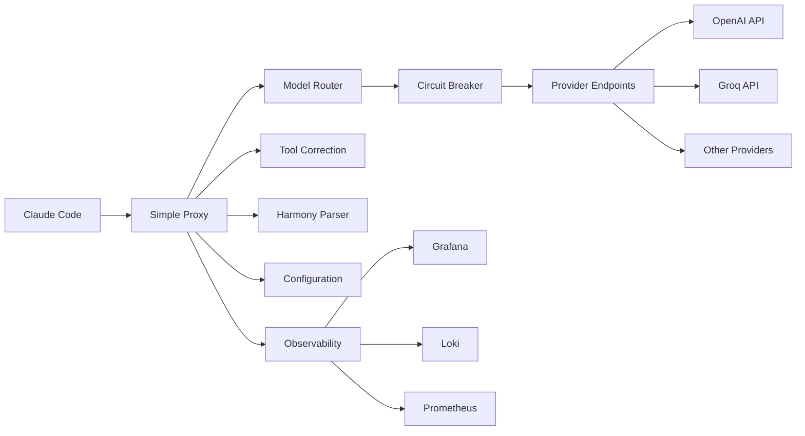

# Simple Proxy

<div align="center">

**🚀 Enterprise-Grade Claude Code Proxy**

[](https://golang.org/)
[](LICENSE)
[](https://cookbook.openai.com/articles/gpt-oss/handle-raw-cot)

*Transform Anthropic API requests to OpenAI-compatible format with advanced tool management, intelligent routing, and enterprise observability.*

[Features](#-features) • [Quick Start](#-quick-start) • [Configuration](#-configuration) • [API Reference](#-api-reference) • [Architecture](#-architecture) • [Contributing](#-contributing)

</div>

---

## 🌟 Features

### **🔄 Seamless API Translation**
- **Bidirectional Format Conversion**: Perfect Anthropic ↔ OpenAI API compatibility
- **Streaming Support**: Full streaming response handling with proper reconstruction
- **Message Transformation**: Intelligent content and tool call conversion
- **Error Handling**: Graceful fallbacks and detailed error reporting

### **🤖 Advanced Tool Management**
- **AI-Powered Tool Correction**: Automatic validation and repair of malformed tool calls
- **Custom Tool Descriptions**: YAML-based tool customization and filtering
- **Loop Detection**: Prevents infinite correction cycles with intelligent circuit breaking
- **Schema Restoration**: Automatic recovery from corrupted tool schemas

### **🎯 Intelligent Model Routing**
- **Multi-Endpoint Load Balancing**: Distribute requests across multiple providers
- **Circuit Breaker System**: Health-aware routing with automatic failover
- **Success Rate Tracking**: Dynamic endpoint reordering based on performance
- **Big Model Bypass**: Special handling for large model endpoints

### **📊 Enterprise Observability**
- **Grafana + Loki Integration**: Real-time log aggregation and visualization
- **Structured Logging**: Comprehensive request tracing with correlation IDs
- **Prometheus Metrics**: Performance monitoring and alerting
- **Health Monitoring**: Detailed endpoint health tracking

### **🧠 OpenAI Harmony Format Support**
- **100% Compliance**: Full support for all 7 official OpenAI Harmony tokens
- **Structured AI Responses**: Automatic parsing of thinking chains and analysis
- **Context Management**: Session-based conversation continuity
- **Advanced Token Handling**: Support for `<|constrain|>`, `<|call|>`, and all stop tokens

### **⚡ Performance & Reliability**
- **Session Management**: Efficient conversation state tracking
- **Request Optimization**: Intelligent batching and caching strategies
- **Security First**: API key masking, input validation, secure defaults
- **Production Ready**: Comprehensive test coverage with 50+ test suites

---

## 🚀 Quick Start

### Prerequisites
- Go 1.21 or higher
- OpenAI-compatible API endpoint
- Optional: Grafana + Loki for observability

### Installation

```bash
# Clone the repository
git clone https://github.com/yourusername/simple-proxy.git
cd simple-proxy

# Build the application
go build -o simple-proxy

# Set up configuration
cp .env.example .env
# Edit .env with your API endpoints and keys

# Run the proxy
./simple-proxy
```

### Docker Setup

```bash
# Build Docker image
docker build -t simple-proxy .

# Run with environment file
docker run --env-file .env -p 3456:3456 simple-proxy
```

### Basic Usage

```bash
# Health check
curl http://localhost:3456/health

# Send a request
curl -X POST http://localhost:3456/v1/messages \
  -H "Content-Type: application/json" \
  -H "anthropic-version: 2023-06-01" \
  -d '{
    "model": "claude-3-sonnet-20240229",
    "max_tokens": 1024,
    "messages": [
      {"role": "user", "content": "Hello, how are you?"}
    ]
  }'
```

---

## ⚙️ Configuration

### Environment Variables

```bash
# === Core Configuration ===
PORT=3456                                    # Server port (default: 3456)

# === Model Endpoints ===
BIG_MODEL_ENDPOINT="https://api.openai.com"        # For Claude 3.5 Sonnet and larger
BIG_MODEL_API_KEY="sk-your-key-here"
SMALL_MODEL_ENDPOINT="https://api.groq.com"        # For Claude 3 Haiku and smaller  
SMALL_MODEL_API_KEY="gsk-your-key-here"

# === Multi-Endpoint Support ===
BIG_MODEL_ENDPOINTS="endpoint1,endpoint2,endpoint3"    # Load balance across multiple
BIG_MODEL_API_KEYS="key1,key2,key3"
SMALL_MODEL_ENDPOINTS="endpoint1,endpoint2"
SMALL_MODEL_API_KEYS="key1,key2"

# === Circuit Breaker ===
CIRCUIT_BREAKER_ENABLED=true                # Enable health-based routing
CIRCUIT_BREAKER_THRESHOLD=3                 # Failures before circuit opens
CIRCUIT_BREAKER_BACKOFF_MS=5000             # Backoff time in milliseconds

# === Tool Management ===
SKIP_TOOLS="browser,dalle"                  # Comma-separated tools to filter
TOOLS_OVERRIDE_FILE="tools_override.yaml"   # Custom tool descriptions
TOOL_CORRECTION_ENABLED=true                # Enable AI-powered tool correction

# === System Message Overrides ===
SYSTEM_OVERRIDES_FILE="system_overrides.yaml"  # System message modifications

# === OpenAI Harmony Format ===
HARMONY_PARSING_ENABLED=true                # Parse OpenAI Harmony responses
HARMONY_DEBUG=false                          # Detailed Harmony processing logs
HARMONY_STRICT_MODE=false                    # Strict error handling

# === Observability ===
LOKI_URL="http://localhost:3100"            # Loki endpoint for log aggregation
LOG_LEVEL="info"                            # Log level: debug, info, warn, error
REQUEST_LOGGING=true                         # Log all requests/responses
```

### Tool Customization (tools_override.yaml)

```yaml
tools:
  browser:
    description: |
      Custom web browsing tool with enhanced capabilities.
      Supports JavaScript execution and screenshot capture.
    parameters:
      url:
        type: string
        description: "URL to browse with full protocol (https://)"
      
  custom_tool:
    description: "Your custom tool description here"
    parameters:
      param1:
        type: string
        description: "Parameter description"
```

### System Message Overrides (system_overrides.yaml)

```yaml
patterns_to_remove:
  - regex: "You are Claude.*?"
    description: "Remove Claude branding"

replacements:
  - find: "Claude"
    replace: "Assistant"
    description: "Rebrand assistant name"

prepend: |
  You are a helpful AI assistant.
  
append: |
  Always be concise and helpful.
```

---

## 📡 API Reference

### **POST /v1/messages**
Anthropic-compatible chat completions endpoint with OpenAI backend.

**Request Format:**
```json
{
  "model": "claude-3-sonnet-20240229",
  "max_tokens": 1024,
  "messages": [
    {"role": "user", "content": "Your message here"}
  ],
  "tools": [...],
  "stream": false
}
```

**Response Format:**
```json
{
  "id": "msg_123",
  "type": "message",
  "role": "assistant",
  "content": [
    {
      "type": "text",
      "text": "Response content"
    }
  ],
  "model": "claude-3-sonnet-20240229",
  "stop_reason": "end_turn",
  "usage": {
    "input_tokens": 10,
    "output_tokens": 25
  }
}
```

### **GET /health**
Health check endpoint for monitoring.

```json
{
  "status": "healthy",
  "timestamp": "2024-01-01T00:00:00Z",
  "endpoints": {
    "big_model": "healthy",
    "small_model": "healthy"
  }
}
```

### **GET /metrics**
Prometheus metrics for monitoring and alerting.

### **GET /**
Service information and configuration status.

---

## 🏗️ Architecture

### System Overview



### Core Components

| Component | Purpose | Key Features |
|-----------|---------|--------------|
| **Request Transformer** | Format conversion | Anthropic ↔ OpenAI mapping |
| **Model Router** | Intelligent routing | Health-aware endpoint selection |
| **Circuit Breaker** | Fault tolerance | Automatic failover and recovery |
| **Tool Correction** | Tool validation | AI-powered error detection and repair |
| **Harmony Parser** | Response parsing | OpenAI Harmony format support |
| **Configuration** | Multi-source config | Environment, YAML, and runtime |
| **Observability** | Monitoring | Structured logging and metrics |

### Request Flow

1. **Request Reception**: Anthropic format validation and parsing
2. **Tool Processing**: Custom descriptions, filtering, and validation
3. **Model Routing**: Intelligent endpoint selection based on model size
4. **Circuit Breaker**: Health check and failover logic
5. **Format Conversion**: Transform to OpenAI-compatible format
6. **Provider Request**: Send to selected endpoint with retry logic
7. **Response Processing**: Parse and validate provider response
8. **Harmony Parsing**: Extract structured content if present
9. **Response Transform**: Convert back to Anthropic format
10. **Client Response**: Return formatted response to Claude Code

---

## 📊 OpenAI Harmony Format

Simple Proxy provides **100% compliance** with the OpenAI Harmony Response Format specification, automatically parsing structured AI responses with thinking chains.

### Supported Tokens

| Token | ID | Purpose | Status |
|-------|----|---------|---------| 
| `<\|start\|>` | 200006 | Message start | ✅ Supported |
| `<\|end\|>` | 200007 | Message end | ✅ Supported |
| `<\|message\|>` | 200008 | Content marker | ✅ Supported |
| `<\|channel\|>` | 200005 | Channel type | ✅ Supported |
| `<\|constrain\|>` | 200003 | Format constraint | ✅ Supported |
| `<\|return\|>` | 200002 | Return marker | ✅ Supported |
| `<\|call\|>` | 200012 | Tool call end | ✅ Supported |

### Example Processing

**Input (from AI model):**
```
<|start|>assistant<|channel|>thinking
Let me analyze this step by step...
<|channel|>analysis  
The key factors are...
<|channel|>final
Based on my analysis, I recommend...
<|end|>
```

**Output (to client):**
```json
{
  "content": [
    {
      "type": "text", 
      "text": "Based on my analysis, I recommend..."
    }
  ]
}
```

**Developer Access:**
```go
message, _ := parser.ParseHarmonyMessage(content)
thinking := message.GetChannelsByType("thinking")
analysis := message.GetChannelsByType("analysis") 
final := message.GetChannelsByType("final")
```

---

## 🔧 Development

### Building from Source

```bash
# Clone repository
git clone https://github.com/yourusername/simple-proxy.git
cd simple-proxy

# Install dependencies
go mod download

# Build
go build -o simple-proxy

# Run tests
go test ./...

# Run with development settings
go run main.go
```

### Testing

```bash
# Run all tests
go test ./...

# Run specific test suites
go test ./test/harmony_*                     # Harmony format tests
go test ./test/circuit_breaker_*             # Circuit breaker tests  
go test ./test/tool_correction_*             # Tool correction tests

# Run with coverage
go test -coverprofile=coverage.out ./...
go tool cover -html=coverage.out
```

### Project Structure

```
simple-proxy/
├── main.go                      # Application entry point
├── config/                      # Configuration management
│   ├── config.go               # Core configuration
│   └── yaml_loader.go          # YAML file loading
├── proxy/                       # Core proxy functionality  
│   ├── handler.go              # HTTP request handlers
│   ├── transform.go            # Format transformation
│   └── circuit_breaker.go      # Health management
├── parser/                      # OpenAI Harmony parsing
│   ├── harmony.go              # Core parser implementation
│   └── types.go                # Type definitions
├── correction/                  # Tool correction service
│   ├── corrector.go            # AI-powered validation
│   └── loop_detection.go       # Infinite loop prevention
├── test/                        # Comprehensive test suites
│   ├── harmony_*               # Harmony format tests
│   ├── circuit_breaker_*       # Health management tests
│   └── integration_*           # End-to-end tests
├── docs/                        # Documentation
└── examples/                    # Usage examples
```

---

## 📈 Observability & Monitoring

### Grafana Dashboards

Simple Proxy includes pre-built Grafana dashboards for:
- **Request Volume & Latency**: Track throughput and performance
- **Circuit Breaker Status**: Monitor endpoint health and failovers  
- **Tool Correction Metrics**: Success rates and correction patterns
- **Harmony Parsing Stats**: Format detection and parsing performance
- **Error Analysis**: Detailed error categorization and trends

### Key Metrics

```prometheus
# Request metrics
simple_proxy_requests_total{method, endpoint, status}
simple_proxy_request_duration_seconds{method, endpoint}

# Circuit breaker metrics  
simple_proxy_circuit_breaker_state{endpoint}
simple_proxy_endpoint_success_rate{endpoint}

# Tool correction metrics
simple_proxy_tool_corrections_total{tool, correction_type}
simple_proxy_tool_correction_success_rate

# Harmony parsing metrics
simple_proxy_harmony_messages_total{format_detected}
simple_proxy_harmony_parse_duration_seconds
```

### Log Queries (Loki)

```logql
# All proxy requests
{job="simple-proxy"} |= "request_id"

# Failed requests only
{job="simple-proxy"} |= "ERROR" 

# Circuit breaker events
{job="simple-proxy"} |= "circuit_breaker"

# Tool corrections
{job="simple-proxy"} |= "tool_correction"

# Harmony parsing
{job="simple-proxy"} |= "harmony"
```

---

## 🤝 Contributing

We welcome contributions! Please see our [Contributing Guidelines](CONTRIBUTING.md) for details.

### Development Workflow

1. **Fork** the repository
2. **Create** a feature branch (`git checkout -b feature/amazing-feature`)
3. **Write** tests for your changes
4. **Ensure** all tests pass (`go test ./...`)
5. **Commit** your changes (`git commit -m 'Add amazing feature'`)
6. **Push** to the branch (`git push origin feature/amazing-feature`)
7. **Open** a Pull Request

### Code Standards

- **Go Code Style**: Follow standard Go conventions with `gofmt`
- **Test Coverage**: Maintain >80% test coverage for new code
- **Documentation**: Update README and code comments for new features
- **Commit Messages**: Use conventional commit format

---

## 📝 License

This project is licensed under the MIT License - see the [LICENSE](LICENSE) file for details.

---

## 🙏 Acknowledgments

- **OpenAI** for the Harmony Response Format specification
- **Anthropic** for the Claude API and development tools
- **Go Community** for excellent libraries and tooling
- **Contributors** who help make this project better

---

<div align="center">

**Built with ❤️ for the AI development community**

[⭐ Star this repo](https://github.com/iSevenDays/simple-proxy) • [🐛 Report Bug](https://github.com/iSevenDays/simple-proxy/issues) • [✨ Request Feature](https://github.com/iSevenDays/simple-proxy/issues)

</div>